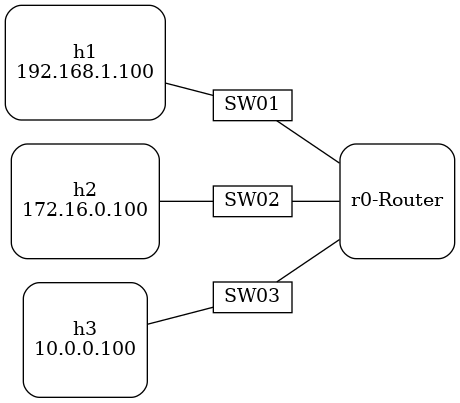

# Secure Global Routing
Internet Society: Secure Global Routing Initiative

Report ([PDF](https://github.com/PMaynard/Secure-Global-Routing/blob/master/docs/report.pdf)|[MD](https://github.com/PMaynard/Secure-Global-Routing/blob/master/docs/report.md))

This repository contians report discussing some of the threats to the global routing infrastructure, and what [Mutually Agreed Norms for Routing Security](https://www.manrs.org/) (MANRS) are doing to improve the situation. 

This repository alos contains a testbed to that allows you to spoof ICMP packets and how to prevent packet spoofing.

# ICMP Spoofing

## Install the Dependencies 

- [mininet](http://mininet.org/): Creates a local testbed network using Linux namespaces.
- [packit](https://linux.die.net/man/8/packit): Packet Spoofing.
- [tshark](https://www.wireshark.org/docs/man-pages/tshark.html): Packet capture and analysis.

They can be installed by running:

	sh icmp-spoof-dependencies.sh

## Run the Testbed

**It is advised to run this on a VM**, not on a production machine. Because we will be changing some important settings on the host. 

	sh run-icmp.sh

This will setup a local network that looks like the below diagram:

1. Listen for packets on each of the hosts (i.e. h1,h2,h3).
	- `xterm hN`
	- `tshark icmp`

2. On the mininet cli, perfrom the packet spoofing via h1:
	- `h1 packit -m inject -t ICMP -c 0 -s 172.16.0.100 -d 10.0.0.100`

3. You should now see output from each of the packet captures.

This will cause ICMP packets to arrive at h3, the destination, and h2, the spoofed node. 

This is what source address spoofing looks like on the wire.

## ICMP Spoofing Mitigations

You can prevent spoofing of this kind by enabling Linux's [rp_filter](https://www.kernel.org/doc/Documentation/networking/ip-sysctl.txt). See [1,2,3,4] for more information. Basically, you have have three options:

0. No source validation.
1. Strict mode as defined in RFC3704 Strict Reverse Path. Each incoming packet is tested against the FIB and if the interface is not the best reverse path the packet check will fail. By default failed packets are discarded.
2. Loose mode as defined in RFC3704 Loose Reverse Path. Each incoming packet's source address is also tested against the FIB and if the source address is not reachable via any interface the packet check will fail.

And they can be enabled like this:

	sysctl -w net.ipv4.conf.default.rp_filter=1
	sysctl -w net.ipv4.conf.all.rp_filter=1
	sysctl -w net.ipv4.conf.s1.rp_filter=1
	sysctl -w net.ipv4.conf.s3.rp_filter=1
	sysctl -w net.ipv4.conf.s2.rp_filter=1 

If you run the above commands on your host and re-run the experiments. You'll find that only h1 sees any ICMP packet. Meaning that the router tests all incoming packets against the FIB and discard the packets.

- [1] https://access.redhat.com/documentation/en-us/red_hat_enterprise_linux/6/html/security_guide/sect-security_guide-server_security-reverse_path_forwarding
- [2] http://blog.serverbuddies.com/disable-icmp-redirect-and-enable-ip-spoofing-protection/
- [3] https://www.slashroot.in/linux-kernel-rpfilter-settings-reverse-path-filtering
- [4] https://www.kernel.org/doc/Documentation/networking/ip-sysctl.txt
