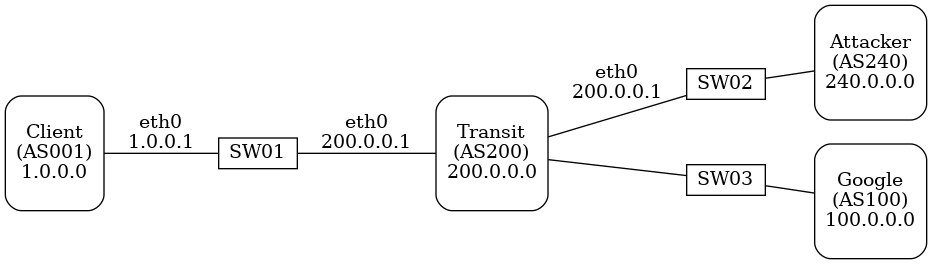
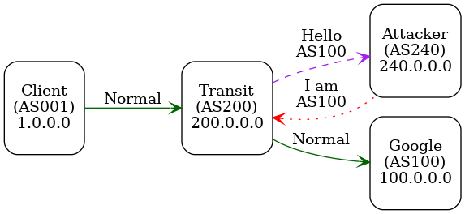

---
title: "Secure Global Routing: A BGP Hijacking and Mitigation Testbed"
author: Peter Maynard, PhD
date: 11th of June, 2020
bibliography: report.bib
link-citations: true
citation-style: http://www.zotero.org/styles/journal-of-eta-maritime-science
abstract:  An Internet society (ISOC) initiative. This report is the result of an ISOC training program, that focused on securing the global routing infrastructure. This report is accompanied with a mininet based BGP testbed which can implement BGP spoofing and mitigation methods. 
--- 

# Global Routing, is that safe?

Mutually Agreed Norms for Routing Security (MANRS) @internet_society_manrs_2019 is Internet Society supported project that aims to unite network operators to secure their networks. As a community MANRS have identified three top threats to the global routing of the internet: 

1. Prefix Hijacking
2. Route Leaks
3. IP Address Spoofing

MANRS addresses these threats through technical and collaborative actions from many players across the internet. More on how will be later in the report.

MANRS believes that the best way to strengthen the core routing systems is by having network operators and Internet Exchange Points (IXPs) to apply the MANRS actions, and having enterprises demand these actions are applied to their service providers.

MANRS has three guiding principles: 

1. Recognise the interdependent nature of the global routing system and your role (as an Service Providers or Enterprise) in contributing to a secure and resilient Internet.
2. Integrate best current practices related to routing security and resilience in network management processes in line with the MANRS actions. 
3. Commit to prevent, detect and mitigate routing incidents through collaboration and coordination with peers and other ISPs in line with MANRS actions.

MANRS has defined four fundamental actions which should be implemented: 

1. **Global Validation**: In order to facilitate validation of routing information on a global scale, network operators must publish their routing information so that other parties may validate it.
2. **Filtering**: In order to prevent propagation of incorrect routing information, network operators must ensure the correctness of their own announcements, and announcements from their customers to adjacent networks with prefix and AS-path granularity. 
3. **Anti-Spoofing**: In order to prevent traffic with spoofed source IP addresses, network operators must enable source address validation for at least single-homed stub customer networks, their own end-users, and infrastructure. 
4. **Coordination**: In order to facilitate global operational communication and coordination between network operators, they much maintain globally accessible and up-to-date contact information. 

Checkout the MANRS Implementation Guide @manrs_implementation_2017 for how one might go about applying some of these actions.

# IRR, RPKI and Peering DB

## Internet Routing Registry

Internet Routing Registry (IRR) is a public database of Internet route objects. This database is used to determine and sharing route and related information to automatically configure routers. If your local Regional Internet Registry (RIR) operates an IRR, you should use it to document your Network Routing Policy and announcements. In Europe the preferred IRR would be RIPE NCC or RADb/NTTCOM. 

The network Routing Policy is documented using Router Policy Specification Language (RPSL), and is defined in RFC 2622 @villamizar_routing_1999. 

Type of information included are:

- **AUT-NUM**: objects contain the registration details of an Autonomous System Number (ASN) that has been assigned to an AS by the Regional Internet registry (RIR)
- **Route/Route6**: objects contain routing information for IPv4/IPv6 address space resources. They show what routes that an AS originates. 
- **AS-SET**: Are used to group ASNs in meaningful ways to make it easier for others to specify routing policies. 

Without this global validation, any server that is configured to use the Border Gateway Protocol (BGP) could participate in the routing policies, because BGP does not have any authentication methods built in. 

There are four step needed to facilitate Origin Validation:

1. Register a Network Routing Policy (aut-num object), and their expected announcements (route object)
2. Document their customer cone (as-set object).
3. Ensure their customers register their expected announcements (route object).
4. Register their expected announcements (ROA object) to a RPKI repository and ensure their customers do the same.

## Resource Public Key Infrastructure 

Resource Public Key Infrastructure (RPKI) is used in addition to the IRR discussed above. RPKI is highly recommended as it provides you with a cryptographically signed objects stating which prefixes an AS is authorised to originate. 

This is done by creating an Router Origin Authorisation Object (ROA). When creating a ROA, one needs to pay special attention to length of the most specific IP prefix allowed field. If set to the length of the prefix, such a ROA may invalidate announcements of more specific, unless the other ROAs are also created from them. 

> i.e. Most specific is always preferred /36 over the less specific /32  

## Peering DB

The Peering DB, located at  <https://www.peeringdb.com/>, supplements the routing information found in IRR and RPKI repositories. It is an open resource for networks to share their peering information and other relevant information. Networks are responsible for maintaining their own records. This would be the first port of call when deciding where, and whom to peer with.

# Filtering, Filtering, and More Filtering 

Now that we have an idea of who should be announcing which network prefixes, how can we implement a system that ensures correctness of our own announcements and announcements from our customers.

By implementing prefix filter, we can permit or deny announcements of certain prefixes from neighbouring ASes. It is important to filter inbound routing advertisements, especially from customer networks. Also, AS-path filters might be used to require a customer network to be explicit about which autonomous systems are downstream from them. 

Without correct filtering hijacking and route leeks are possible: 

- **Prefix Hijacking**: Happen when an AS-00A announces a prefix for another AS-00B  which it does not own. Causing traffic intended AS-00B to arrive at AS-00A. 
- **Route Leaks**: Happen when AS-00A announces its prefix from AS-00B, beyond their intended scope. It can occur when a customer announces routes they learned from an transit provider to another transit provider. Causing traffic to be directed to AS-00A via AS-00B. 

For peers, you should consider implementing bogon filtering. Bogons are fake IP addresses @wikipedia_bogon_2020. 

Thankfully, you don't need to manually take information from IRR or RPKI and create rules from them yourself. There are tools which parse the RPSL and output router commands. 

Some recommended tools:

- <https://github.com/irrtoolset/irrtoolset>
- <https://github.com/snar/bgpq3>
- <https://github.com/6connect/irrpt>

RPKI works with trust anchors that are issued by the Regional Internet Registries, using Resource Certificates (RC). RCs state what address space an AS has been allocated and ROA objects that are created by their customers. 

Again, like the prefix announcements, it is possible to generate router commands from this data. Most routers support using rpki-validators.

- <https://github.com/dragonresearch/rpki.net>

# Anti-Spoofing

IP source address spoofing is, basically, pretending to be another host. The is normally done to perform a DDoS reflection-Amplification attack. Reflection happens and when the attacker sends traffic to a victim via another host. This can be amplified by sending all queues that result in a much larger response. This is commonly done using open DNS resolvers and NTP servers. 

This can be prevented by implementing ingress filtering such as: 

- **Access Control Lists (ACL)**: Commonly deployed on the Provider/Customer Edge. ACLs are used to filter traffic by controlling whether packets are forwarded or blocked based on specific address ranges. They should be deployed on the downstream interfaces of the ISP to verify the source addresses of its customers.
- **Unicast Reverse Path Forwarding (uRPF)**: RFC3704 @savola_ingress_2004, is an evolution of the concept that traffic from known invalid networks should not be accepted. it is often deployed in edges of networks where customers, server, and/or clients are connected. There are four modes:
	- Loose Mode.
	- Feasible Path. (Recommended for multi-homed stub customers.) 
	- VRF Mode.
	- Strict. (Recommended for single-homed stub customers.)

It is important to make sure that spoofing is periodically tested, to make sure it is correctly blocked. Tools such as <https://www.caida.org/projects/spoofer/> can help, and should be run by one of your customers. 

# Testbed

## Border Gateway Protocol 

Border Gateway Protocol (BGP) @wikipedia_border_2020-1 is a standardised exterior gateway routing protocol, designed to exchange routing and reachability information among autonomous systems (AS) @wikipedia_autonomous_2020 on the Internet. It was first defined in 1994, we are currently on version 4, as defined in RFC 4271 @hares_border_2006 in 2006. 

## Configuration

## Attack

Global Validation had some nice attack diagrams

## Mitigation

# Conclusion

# Acknowledgements

I wish to thank my instructors Dr. Ronoh Kennedy from ISOC, and Musa Stephen from AFRINIC for their informative training sessions. I would also like to thank Dr. Olivier MJ Crépin-Leblond from the UK England ISOC chapter for his support. 

The report is heavily based on the ISOC 'Secure Global Routing' training materials that a licensed under Attribution-NonCommercial-NoDerivatives 4.0 International, and the content presented by Dr. Ronoh Kennedy.

# References 

